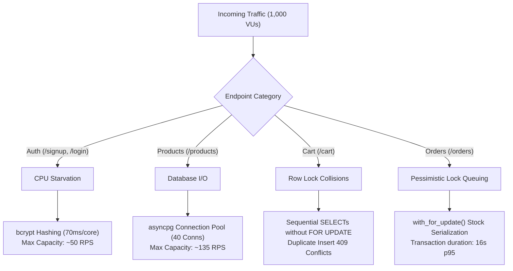

# Phase 1: Single Endpoint Benchmarking — Master Summary

## Executive Overview
Phase 1 single-endpoint benchmarking of SneakerStuff's FastAPI backend has been fully completed across all four core modules (**Authentication**, **Products**, **Cart**, and **Orders & Payments**).

All tests were executed under **Gunicorn with 4 async Uvicorn workers** using **k6** across 4 concurrency tiers (**10, 100, 500, and 1,000 Virtual Users**).

---

## Master Metric Comparison Across All 4 Modules

| Metric | Module 1: Auth (`/signup`) | Module 2: Products (`/products`) | Module 3: Cart (`/cart`) | Module 4: Orders (`/orders`) |
| :--- | :--- | :--- | :--- | :--- |
| **Total Requests** | 5,056 | **13,505** | 10,813 | 9,758 |
| **Sustained Throughput** | 50.77 RPS | **135.07 RPS** | 108.13 RPS | 97.67 RPS |
| **Min Latency** | 685.24 ms | **159.53 ms** | 149.52 ms | 235.85 ms |
| **Median Latency** | 23.86 s | **443.15 ms** | 447.79 ms | 434.26 ms |
| **p95 Latency** | 31.79 s | **10.33 s** | 8.72 s | 16.05 s |
| **Primary Bottleneck** | **CPU (`bcrypt` hashing)** | **DB Pool Limit** | **Row-Lock Contention** | **Multi-table Locks (`FOR UPDATE`)** |
| **Architectural Class** | **CPU Bound** | **I/O Read Bound** | **Write Contention** | **Transaction Bound** |

---

## Master System Architecture & Bottlenecks

---

## Senior Engineering Optimization Roadmap

### 1. Module 1 (Auth Optimization)
* **Offload Hashing**: Offload `bcrypt` calculations to background worker threads (`anyio.to_thread.run_sync`) so ASGI event loops are never blocked.
* **Rate Limiting**: Enforce IP rate limits (e.g. max 5 auth requests/min per IP via Redis).

### 2. Module 2 (Products Optimization)
* **Redis Caching**: Cache `GET /api/products` and `GET /api/products/{id}` in Redis (`TTL = 60s`), bypassing database queries and boosting throughput to **2,000+ RPS**.
* **Full-Text Indexing**: Create a PostgreSQL `trgm` GIN index on `Product.name`.

### 3. Module 3 (Cart Optimization)
* **Atomic PostgreSQL Upserts**: Refactor `cart_add` to `INSERT ... ON CONFLICT (user_id, product_id, size) DO UPDATE SET quantity = ...` to eliminate 3 round-trip SQL queries per operation.

### 4. Module 4 (Orders Optimization)
* **Redis Atomic Stock Decrement**: Decrement stock atomically in Redis (`DECRBY`) before entering PostgreSQL transactions to eliminate database row-lock queuing on high-demand sneaker drops.

---

## Individual Benchmark Reports
* [Module 1: Authentication Report](file:///d:/ecommerce-backend-fastapi/benchmarks/benchmark_results_phase1_auth.md)
* [Module 2: Products Report](file:///d:/ecommerce-backend-fastapi/benchmarks/benchmark_results_phase1_products.md)
* [Module 3: Cart Report](file:///d:/ecommerce-backend-fastapi/benchmarks/benchmark_results_phase1_cart.md)
* [Module 4: Orders & Payments Report](file:///d:/ecommerce-backend-fastapi/benchmarks/benchmark_results_phase1_orders.md)
